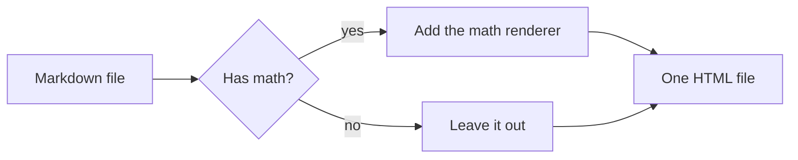
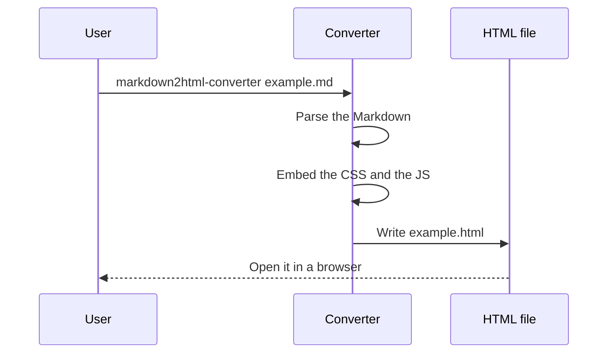
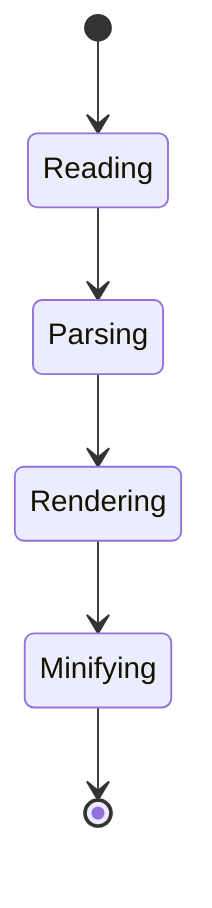
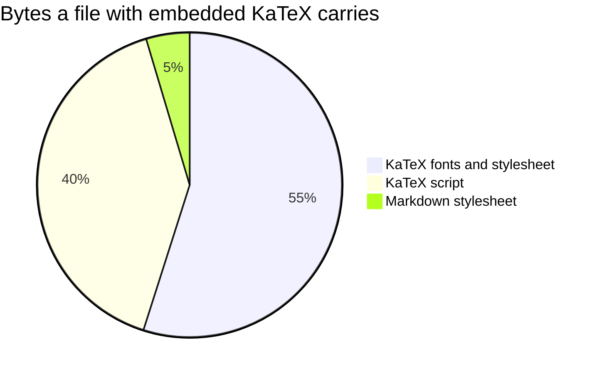

# h1 Heading
## h2 Heading
### h3 Heading
#### h4 Heading
##### h5 Heading
###### h6 Heading


## Horizontal Rules

___

---

***

## Emphasis

**This is bold text**

__This is bold text__

*This is italic text*

_This is italic text_

~~Strikethrough~~

**這句話很重要。**但這句話並不重要。

## Emoji

Emoji can be written directly: 😀 🎉 🚀 🐛 ✅ ❤️

They also work inside a sentence, mixed with CJK text: 這個工具很好用 👍，快去試試看 🎉！

Modifiers and sequences are supported as well: 👍🏽 👨‍👩‍👧‍👦 🇹🇼 🏳️‍🌈

Emoji still work in **bold text 🔥**, `inline code 💻`, [links 🔗](https://magiclen.org), and headings.

| Status | Meaning |
| --- | --- |
| ✅ | Done |
| ⚠️ | Needs attention |
| ❌ | Failed |

## Blockquotes

> Blockquotes can also be nested...
>> ...by using additional greater-than signs right next to each other...
> > > ...or with spaces between arrows.

## Alerts

> [!NOTE]
> Useful information that users should know, even when skimming content.

> [!TIP]
> Helpful advice for doing things better or more easily.

> [!IMPORTANT]
> Key information users need to know to achieve their goal.

> [!WARNING]
> Urgent info that needs immediate user attention to avoid problems.

> [!CAUTION]
> Advises about risks or negative outcomes of certain actions.

## Lists

Unordered

+ Create a list by starting a line with `+`, `-`, or `*`
+ Sub-lists are made by indenting 2 spaces:
  - Marker character change forces new list start:
    * Ac tristique libero volutpat at
    + Facilisis in pretium nisl aliquet
    - Nulla volutpat aliquam velit
+ Very easy!

Ordered

1. Lorem ipsum dolor sit amet
2. Consectetur adipiscing elit
3. Integer molestie lorem at massa


1. You can use sequential numbers...
1. ...or keep all the numbers as `1.`

Start numbering with offset:

57. foo
1. bar

Task list

- [x] Finish my changes
- [ ] Push my commits
- [ ] Open a pull request

## Code

Inline `code`

Indented code

    // Some comments
    line 1 of code
    line 2 of code
    line 3 of code


Block code "fences"

```
Sample text here...
```

### Syntax Highlighting

JavaScript

``` js
var foo = function (bar) {
  return bar++;
};

console.log(foo(5));
```

Rust

```rust
use std::collections::HashMap;

fn main() {
    let mut counts: HashMap<&str, u32> = HashMap::new();

    for word in "the quick brown fox jumps over the lazy dog".split_whitespace() {
        *counts.entry(word).or_insert(0) += 1;
    }

    println!("{counts:?}");
}
```

Python

```python
from dataclasses import dataclass


@dataclass
class Point:
    x: float
    y: float

    def distance_to(self, other: "Point") -> float:
        return ((self.x - other.x) ** 2 + (self.y - other.y) ** 2) ** 0.5


print(Point(0, 0).distance_to(Point(3, 4)))  # 5.0
```

TypeScript

```typescript
interface User {
    id: number;
    name: string;
    email?: string;
}

async function fetchUser(id: number): Promise<User> {
    const response = await fetch(`/api/users/${id}`);

    if (!response.ok) {
        throw new Error(`Request failed with ${response.status}`);
    }

    return response.json() as Promise<User>;
}
```

Go

```go
package main

import "fmt"

func fib(n int) int {
    if n < 2 {
        return n
    }

    return fib(n-1) + fib(n-2)
}

func main() {
    fmt.Println(fib(10)) // 55
}
```

C

```c
#include <stdio.h>

int main(void) {
    for (int i = 1; i <= 3; ++i) {
        printf("line %d\n", i);
    }

    return 0;
}
```

Shell

```bash
#!/usr/bin/env bash
set -euo pipefail

for file in ./*.md; do
    markdown2html-converter "$file" --theme dark --force
    echo "converted ${file}"
done
```

SQL

```sql
SELECT u.name, COUNT(o.id) AS order_count
FROM users AS u
LEFT JOIN orders AS o ON o.user_id = u.id
WHERE u.created_at >= '2024-01-01'
GROUP BY u.name
HAVING COUNT(o.id) > 3
ORDER BY order_count DESC;
```

HTML

```html
<!DOCTYPE html>
<html lang="en">
<head>
    <meta charset="UTF-8">
    <title>Hello</title>
</head>
<body>
    <p class="greeting">Hello world!</p>
</body>
</html>
```

CSS

```css
.markdown-body {
    max-width: 980px;
    margin: 0 auto;
    padding: 45px;
}

@media (prefers-color-scheme: dark) {
    body {
        background-color: #0d1117;
    }
}
```

JSON

```json
{
    "name": "markdown2html-converter",
    "version": "2.0.0",
    "keywords": ["markdown", "html", "MathJax"],
    "minify": true
}
```

YAML

```yaml
name: CI
on: [ push, pull_request ]
jobs:
  test:
    runs-on: ubuntu-latest
    steps:
      - uses: actions/checkout@v7
      - run: cargo test
```

TOML

```toml
[package]
name = "markdown2html-converter"
version = "2.0.0"
edition = "2024"

[dependencies]
comrak = { version = "0.54", default-features = false }
```

Makefile

```makefile
EXECUTABLE_NAME := markdown2html-converter

all: ./target/release/$(EXECUTABLE_NAME)

./target/release/$(EXECUTABLE_NAME):
	cargo build --release

clean:
	cargo clean
```

Diff

```diff
--- a/README.md
+++ b/README.md
@@ -1,3 +1,3 @@
 # Title
-The old line.
+The new line.
```

Dockerfile

```dockerfile
FROM rust:alpine AS builder
WORKDIR /app
COPY . .
RUN cargo build --release

FROM alpine:latest
COPY --from=builder /app/target/release/markdown2html-converter /usr/local/bin/
ENTRYPOINT [ "markdown2html-converter" ]
```

Nginx

```nginx
server {
    listen 443 ssl;
    server_name magiclen.org;

    location / {
        root /var/www/html;
        try_files $uri $uri/ =404;
    }
}
```

Apache

```apache
<VirtualHost *:80>
    ServerName magiclen.org
    DocumentRoot /var/www/html

    <Directory /var/www/html>
        Require all granted
    </Directory>
</VirtualHost>
```

## Tables

| Option | Description |
| ------ | ----------- |
| data   | path to data files to supply the data that will be passed into templates. |
| engine | engine to be used for processing templates. Handlebars is the default. |
| ext    | extension to be used for dest files. |

Right aligned columns

| Option | Description |
| ------:| -----------:|
| data   | path to data files to supply the data that will be passed into templates. |
| engine | engine to be used for processing templates. Handlebars is the default. |
| ext    | extension to be used for dest files. |


## Links

[link text](http://dev.nodeca.com)

[link with title](http://nodeca.github.io/pica/demo/ "title text!")

Autoconverted link https://github.com/nodeca/pica (enable linkify to see)

## Footnotes

Here is a footnote reference[^1].

[^1]: Here is the footnote itself.

## Images


Like links, Images also have a footnote style syntax

![Alt text][id]

With a reference later in the document defining the URL location:

[id]: https://octodex.github.com/images/dojocat.jpg  "The Dojocat"

## Math

Inline math equation: $\omega = d\phi / dt$. Display math should get its own line like so:

$$I = \int \rho R^{2} dV$$

A math block works as well:

```math
\frac{\partial u}{\partial t} = h^2 \left( \frac{\partial^2 u}{\partial x^2} + \frac{\partial^2 u}{\partial y^2} \right)
```

## Mermaid

A `mermaid` block is drawn as a diagram instead of being shown as code.

Flowchart



Sequence diagram



State diagram



Pie chart


